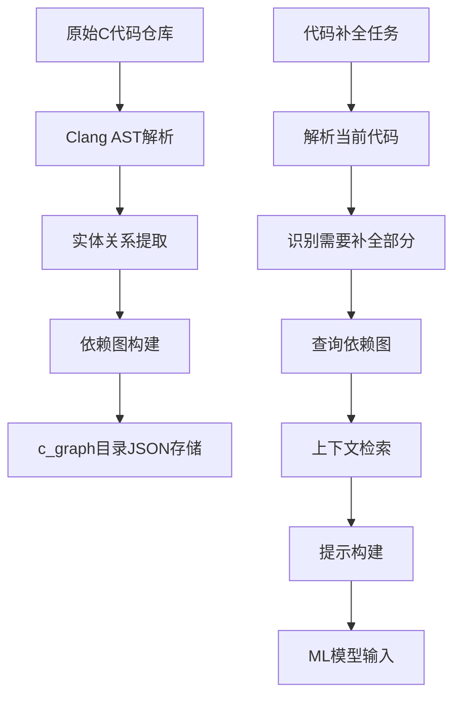

# ccoder 技术方案文档

## 概述

ccoder 是一个基于代码依赖图的 C 语言代码补全增强系统。该系统通过分析源代码仓库构建详细的依赖关系图，然后在执行代码补全任务时利用这些上下文信息来提高补全准确率。

## 系统架构

### 核心组件

1. **预处理器 (`preprocess.py`)**: 解析整个代码仓库，构建依赖关系图
2. **解析器 (`cfile_parse.py`)**: 使用 Clang AST 分析 C 代码结构
3. **检索器 (`node_prompt.py`)**: 根据请求从依赖图中检索相关信息
4. **生成器 (`generator.py`)**: 构建最终的提示(prompt)，供大语言模型使用
5. **主程序 (`main.py`)**: 协调整个流程，生成优化后的提示文件
6. **评估器 (`evaluation.py`)**: 评估代码补全的准确性和相似度

## 关键技术流程

### 1. 代码仓库图构建 (Graph Construction)

系统首先将原始代码仓库转换为结构化的依赖图存储于 `CEval/c_graph/` 目录下：

- **代码解析**: 利用 Clang 库解析每个 `.c` 和 `.h` 文件，提取 AST 信息
- **实体识别**: 识别函数定义、变量声明、结构体、枚举、typedefs等
- **依赖关系建立**: 分析引用关系，例如：
  - 函数对其他函数的调用
  - 变量类型引用
  - 结构体成员关系
  - 头文件包含关系
- **图存储**: 将分析结果以 JSON 格式存储，每个仓库对应一个 JSON 文件

### 2. 上下文检索与提示构建

在执行代码补全任务时，系统会根据当前代码和需求动态构建更丰富的提示：

- **依赖追溯**: 从当前代码中使用的标识符出发，通过依赖图追踪相关定义
- **上下文聚合**: 收集相关的函数定义、类型声明、宏定义等
- **智能截断**: 根据模型输入长度限制，智能选择最重要的上下文信息
- **提示拼接**: 将原始代码、检索到的上下文和路径信息组合成完整的提示

### 3. 智能检索算法

系统实现了深度优先搜索算法来遍历依赖关系：

- **多跳检索**: 可配置最大检索深度（hop），控制上下文范围
- **拓扑排序**: 对检索到的文件按依赖顺序进行排序，确保先出现被依赖的内容
- **循环依赖处理**: 避免在依赖图中无限循环

## 代码逻辑流程

## 技术优势

### 1. 上下文感知
传统的代码补全只考虑当前文件或局部上下文，而 ccoder 通过分析整个项目的依赖关系，能够提供更全面的全局上下文。

### 2. 动态适应
系统不是简单地添加固定模板，而是根据当前代码的具体需求动态检索和组装相关的上下文信息。

### 3. 智能截断
考虑到大语言模型的输入长度限制，系统实现了一套智能截断机制，保留最关键的信息。

### 4. 类型安全
通过静态分析识别变量类型、函数签名等，避免类型错误导致的补全失败。

## 数据流

1. **训练/预处理阶段**:
   - 输入: `CEval/c_repo/[project_name]/` (源代码)
   - 输出: `CEval/c_graph/[project_name].json` (依赖图)

2. **提示生成阶段**:
   - 输入: `CEval/c_metadata.jsonl` (补全任务描述)
   - 中间件: `CEval/c_graph/[project_name].json` (依赖图)
   - 输出: `CEval/c_[model_name]_prompt.jsonl` (增强提示)

3. **模型推理阶段**:
   - 输入: 增强提示
   - 输出: 补全代码

## 配置参数

- `MAX_HOP`: 最大检索深度（默认无限制）
- `ONLY_DEF`: 仅包含定义而非完整实现
- `ENABLE_DOCSTRING`: 包含文档字符串
- `LAST_K_LINES`: 包含最后K行源码作为上下文

## 评估指标

系统提供两种评估方法：
- **精确匹配 (Exact Match)**: 完全匹配比例
- **编辑相似度 (Edit Similarity)**: 编辑距离计算的相似度

通过对比原始提示和增强提示的效果，可以量化系统改进的幅度。

## 实际应用效果

相比基线方法，ccoder 通过以下方式提高了代码补全的准确率：
1. 提供相关函数和类型定义，减少错误引用
2. 包含必要的头文件信息，确保语法正确
3. 维护正确的依赖顺序，符合编译要求
4. 提供足够的上下文，帮助模型理解当前代码意图